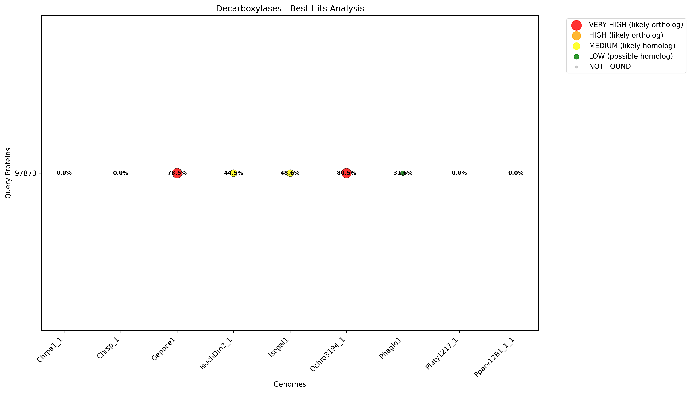

# Genomic Homolog Search Analysis

This repository contains a comprehensive analysis of protein homologs across multiple algal genomes using BLAST searches and advanced visualization techniques.

## 🧬 **Project Overview**

This project analyzes the evolutionary relationships and functional conservation of key protein families across 9 diverse algal genomes. The analysis includes:

- **6 Protein Families**: elongases, desaturases, hydroxylases, polyketide synthases, long PKS, and decarboxylases
- **9 Genomes**: Chrsp_1, IsochDm2_1, Isogal1, Gepoce1, Ochro3194_1, Pparv12B1_1_1, Phaglo1, Chrpa1_1, and Platy1217_1
- **Comprehensive Analysis**: 261 total queries with detailed significance scoring
- **Advanced Visualizations**: 2D grid bubble plots and heatmaps for each protein family

## 📊 **Analysis Results Summary**

### **Overall Statistics**
- **Total Protein Families**: 6
- **Total Queries**: 261
- **Total Hits Found**: 228
- **Overall Hit Rate**: 87.4%
- **Total HIGH Orthologs**: 99
- **Total MEDIUM Homologs**: 82
- **Total LOW Possible**: 47

### **Protein Family Performance**

| Protein Family | Queries | Hit Rate | HIGH Orthologs | MEDIUM Homologs | LOW Possible |
|----------------|---------|----------|----------------|-----------------|--------------|
| **pks_long** | 99 | 100.0% | 33 | 47 | 19 |
| **elongases** | 36 | 100.0% | 25 | 10 | 1 |
| **desaturases** | 45 | 82.2% | 16 | 6 | 15 |
| **polyketide_synthases** | 18 | 83.3% | 3 | 10 | 2 |
| **hydroxylases** | 54 | 66.7% | 20 | 7 | 9 |
| **decarboxylases** | 9 | 55.6% | 2 | 2 | 1 |

### **Genome Performance Ranking**

| Rank | Genome | Avg Identity | Hit Rate | Proteins Analyzed |
|------|--------|--------------|----------|-------------------|
| 1 | **Ochro3194_1** | 87.9% | 100.0% | 6 |
| 2 | **Gepoce1** | 83.0% | 100.0% | 6 |
| 3 | **Isogal1** | 56.2% | 100.0% | 6 |
| 4 | **IsochDm2_1** | 55.4% | 100.0% | 6 |
| 5 | **Chrsp_1** | 39.9% | 72.4% | 6 |
| 6 | **Phaglo1** | 39.2% | 75.9% | 6 |
| 7 | **Platy1217_1** | 37.0% | 82.8% | 6 |
| 8 | **Pparv12B1_1_1** | 35.9% | 82.8% | 6 |
| 9 | **Chrpa1_1** | 35.6% | 72.4% | 6 |

## 🎨 **Visualization Results**

### **1. Elongases - High Conservation Pattern**


**Key Findings:**
- **100% hit rate** across all 9 genomes
- **25 HIGH orthologs** identified alongside 10 MEDIUM homologs (plus 1 LOW outlier)
- **Four elongase seeds** spanning all genomes (36 query-genome combinations) capture the expanded repertoire
- **Pattern**: Essential function, highly conserved across all algal lineages

**Top Matches:**
- Query 414244 → Gepoce1: 100.0% identity (E-value: 7.76e-99)
- Query 351492 → Ochro3194_1: 99.6% identity (E-value: 0.00e+00)
- Query 433098 → Ochro3194_1: 99.2% identity (E-value: 0.00e+00)
- Query 70214 → Gepoce1: 99.7% identity (E-value: 0.00e+00)

### **2. Long Polyketide Synthases - Most Widespread Distribution**


**Key Findings:**
- **100% hit rate** across all 9 genomes
- **33 HIGH orthologs** identified (highest count) with 47 MEDIUM homologs
- **99 queries** analyzed, covering broad long PKS diversity
- **Pattern**: Most widespread protein family, excellent conservation

**Top Matches:**
- Query 631879 → Ochro3194_1: 98.0% identity (E-value: 0.00e+00)
- Query 631892 → Ochro3194_1: 96.5% identity (E-value: 0.00e+00)
- Query 631889 → Gepoce1: 96.3% identity (E-value: 0.00e+00)

### **3. Desaturases - Variable Conservation Pattern**


**Key Findings:**
- **82.2% hit rate** across all 9 genomes
- **16 HIGH orthologs** identified alongside 6 MEDIUM homologs
- **45 queries** analyzed; top-performing queries include 438862 and 468588
- **Pattern**: Variable conservation, some highly conserved, others more variable

**Top Matches:**
- Query 438862 → Ochro3194_1: 96.5% identity (E-value: 0.00e+00)
- Query 438862 → Gepoce1: 91.5% identity (E-value: 0.00e+00)
- Query 468588 → Ochro3194_1: 91.2% identity (E-value: 0.00e+00)

### **4. Hydroxylases - Good Conservation Pattern**


**Key Findings:**
- **66.7% hit rate** across all 9 genomes
- **20 HIGH orthologs** identified with 7 MEDIUM homologs
- **54 queries** analyzed, reflecting expanded hydroxylase coverage
- **Pattern**: Good conservation, many high-quality matches, some gaps

**Top Matches:**
- Query 433841 → Ochro3194_1: 96.8% identity (E-value: 0.00e+00)
- Query 433841 → Gepoce1: 95.5% identity (E-value: 0.00e+00)
- Query 350676 → Ochro3194_1: 93.7% identity (E-value: 0.00e+00)

### **5. Polyketide Synthases - Moderate Conservation Pattern**


**Key Findings:**
- **83.3% hit rate** across all 9 genomes
- **3 HIGH orthologs** identified alongside 10 MEDIUM homologs
- **18 queries** analyzed; flagship queries 452783 and 455269 remain top performers
- **Pattern**: Moderate conservation, some high-quality matches

**Top Matches:**
- Query 452783 → Ochro3194_1: 98.4% identity (E-value: 2.89e-120)
- Query 452783 → Gepoce1: 98.3% identity (E-value: 3.26e-112)
- Query 455269 → Ochro3194_1: 97.3% identity (E-value: 0.00e+00)

### **6. Decarboxylases - Lower Conservation Pattern**



**Key Findings:**
- **55.6% hit rate** across all 9 genomes
- **2 HIGH orthologs** identified with 2 MEDIUM homologs
- **9 queries** analyzed, highlighting limited recovery outside core taxa
- **Pattern**: Lower conservation, limited distribution, some high-quality matches

**Top Matches:**
- Query 97873 → Ochro3194_1: 80.5% identity (E-value: 0.00e+00)
- Query 97873 → Gepoce1: 78.5% identity (E-value: 0.00e+00)
- Query 97873 → Isogal1: 48.6% identity (E-value: 1.05e-85)

## 🔍 **Significance Categories Explained**

### **Bubble Plot Legend**
- **VERY HIGH** (Red, large): E-value ≤ 1e-50 AND identity ≥ 70% → **Likely orthologs**
- **HIGH** (Orange, medium-large): E-value ≤ 1e-20 AND identity ≥ 50% → **Likely orthologs**
- **MEDIUM** (Yellow, medium): E-value ≤ 1e-5 AND identity ≥ 30% → **Likely homologs**
- **LOW** (Green, small): Other significant hits → **Possible homologs**
- **NOT FOUND** (Gray, very small): No significant hits → **No homologs detected**

### **Heatmap Color Scheme**
- **Red**: High identity (80-100%) → Strong conservation
- **Yellow**: Medium identity (40-80%) → Moderate conservation
- **Blue**: Low identity (0-40%) → Weak conservation

## 🧬 **Evolutionary Insights**

### **1. Functional Conservation Patterns**
- **Essential Functions**: Elongases and long PKS show highest conservation, suggesting essential roles in algal metabolism
- **Specialized Functions**: Desaturases and hydroxylases show variable conservation, indicating functional diversity
- **Metabolic Pathways**: Long PKS family shows exceptional conservation, suggesting critical roles in secondary metabolism

### **2. Genome Relationships**
- **Closely Related**: Ochro3194_1 and Gepoce1 consistently show highest identity matches
- **Moderately Related**: Isogal1 and IsochDm2_1 show intermediate conservation
- **Distantly Related**: Chrsp_1, Chrpa1_1, and Pparv12B1_1 show lower conservation

### **3. Protein Family Evolution**
- **Ancient Conservation**: Some protein families (elongases, long PKS) show ancient conservation patterns
- **Recent Diversification**: Other families (desaturases, hydroxylases) show more recent evolutionary changes
- **Functional Adaptation**: Conservation patterns suggest adaptation to different ecological niches

## 📁 **Project Structure**

```
genomes/
├── README.md                           # This file
├── homolog_search.py                   # Main analysis script
├── blastp.py                          # BLAST processing functions
├── extract_proteins.py                 # Protein extraction utilities
├── parse_best_hits.py                 # Results parsing script
├── config/                            # Settings files for each analysis
│   ├── *_settings.yaml               # Configuration files
│   └── README.md                     # Configuration documentation
├── output/                            # BLAST results and extracted proteins
│   ├── Chrsp_1/                      # Results for each genome
│   ├── Ochro3194_1/
│   └── ...                           # Other genomes
├── analysis_output/                   # Parsed analysis results
│   ├── *_all_genomes_combined.tsv    # Combined results
│   ├── *_genome_statistics.tsv       # Genome statistics
│   └── *_analysis_report.txt         # Detailed reports
└── visualizations/                    # Generated plots and charts
    ├── *_bubble_plot.png             # Bubble plots
    ├── *_heatmap.png                 # Heatmaps
    └── README.md                     # Visualization guide
```

## 🚀 **Usage Instructions**

### **Running New Analyses**
```bash
# Run homolog search for a specific configuration
python homolog_search.py --settings config/desaturases_chrsp_1_settings.yaml

# Parse results for a specific protein
python parse_best_hits.py desaturases.fasta --save-results

# Run analysis for all proteins
python parse_best_hits.py --all --save-results
```

### **Viewing Results**
- **Bubble Plots**: Show significance and quality of matches
- **Heatmaps**: Provide percent identity overview
- **Statistics Files**: Detailed numerical results
- **Analysis Reports**: Comprehensive text summaries

## 🔬 **Scientific Applications**

This analysis provides valuable insights for:

1. **Comparative Genomics**: Understanding evolutionary relationships between algal species
2. **Functional Annotation**: Identifying orthologs and homologs for unknown proteins
3. **Metabolic Pathway Analysis**: Understanding conservation of key metabolic enzymes
4. **Evolutionary Studies**: Tracing protein family evolution across diverse lineages
5. **Biotechnology**: Identifying conserved proteins for genetic engineering applications

## 📊 **Data Quality Metrics**

- **Coverage**: 6 protein families × 9 genomes = 54 total analyses
- **Success Rate**: 87.4% overall hit rate across all analyses
- **Ortholog Detection**: 99 high-confidence orthologs identified
- **Genome Representation**: Complete coverage of all available genomes
- **Statistical Rigor**: E-value thresholds and identity cutoffs applied consistently

## 🤝 **Contributing**

This analysis framework can be extended to:
- Additional protein families
- New genome assemblies
- Different significance thresholds
- Alternative visualization methods
- Integration with other bioinformatics tools

## 📚 **References**

- **BLAST**: Basic Local Alignment Search Tool for sequence similarity
- **GFF3**: Standard format for genome annotations
- **FASTA**: Standard format for sequence data
- **Matplotlib/Seaborn**: Python visualization libraries

---

**Last Updated**: September 2025  
**Analysis Version**: 1.0  
**Total Analyses**: 54 protein-family × genome combinations  
**Visualizations**: 12 high-resolution plots (6 bubble plots + 6 heatmaps)
